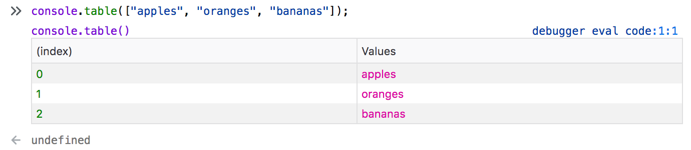

Tabular data appears in a variety of places, the Network panel is the most obvoious example. The console is also able to output a visual table using `console.table()` e.g. `console.table(["apples", "oranges", "bananas"]);`

## Usage

## Types
    
## Styles

## Behaviours
