Trees are a navigation method which provide access to data of a hierarchical format.

## Usage

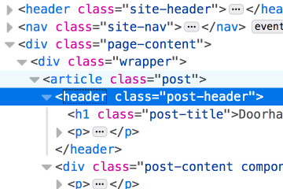

Trees provide the mechanism for users to "drill down" data.

Use a tree when you need to provide access to data where a hierarchy or ordered structure is present, data that can be interpreted with a parent/child relationship. A folder or file system is a prime example.

## Types

### Code Tree

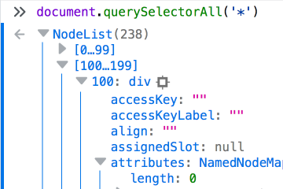

The Inspector and the console both present examples of a code tree. 
The DOM is navigable in the Inspector panel and a NodeList can be expanded in the console through the use of code trees.   

Designed to fit within the visual parameters of a typical page source view, this type of tree has behavioural and visual differences to a panel tree.

### Panel Tree

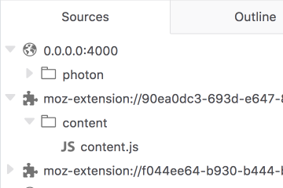

Panel trees are those present in the DevTools panels like the debugger Sources list, Storage panel and eventually the Event Listeners panel. 

Unless you are presenting expandable code to the user, a panel tree is the correct choice.  

### DOM Panel Tree

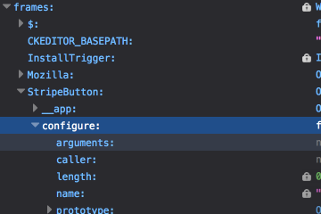

Similar to a code tree, the DOM Panel presents a hierarchy of data, representative of the properties of the DOM in the current window. The DOM panel has some stylistic differences to a typical code tree but operates in the same fashion.

## Styles

### Color

#### Code Tree

  <input type="radio" name="codetree-style-color" id="codetree-lightmode" checked="checked">
  <label for="codetree-lightmode">Light</label>
  

Arrow: Grey 40 `#b1b1b3`

Tree indent border: Blue 55 `#0074e8`

Background Hover: `#F0F9FE` *Photon color needed*

#### Selected node
Background: Blue 55 `#0074e8`

Arrow: semi-opaque image, *Photon color needed*

Text: white `#ffffff`

  

  <input type="radio" name="codetree-style-color" id="codetree-darkmode">
  <label for="codetree-darkmode">Dark</label>
  

Arrow: Grey 50 `#737373`

Tree indent border: Blue 40 `#45a1ff`

Background Hover: `#353B48` *Photon color needed*

#### Selected node
Background: Blue 70 `#003eaa`

Arrow: semi-opaque image, *Photon color needed*

Text: white `#ffffff`

  

#### Panel Tree

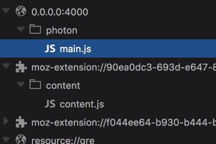

  <input type="radio" name="paneltree-style-color" id="paneltree-lightmode" checked="checked">
  <label for="paneltree-lightmode">Light</label>
  

Arrow: Grey 25 `#e0e0e2`

Icon: Grey 50 `#737373`

Text: Grey 60 `#4a4a4f`

#### Selected node
Background : Blue 55 `#0074e8`

Arrow: white `#ffffff`

Icon: white `#ffffff`

Text: white `#ffffff`

  

  <input type="radio" name="paneltree-style-color" id="paneltree-darkmode">
  <label for="paneltree-darkmode">Dark</label>
  

Arrow: Grey 60 `#4a4a4f`

Icon: Grey 45 `#939395`

Text: Grey 40 `#b1b1b3`

#### Selected node
Background : Blue 70 `#003eaa`

Arrow: white `#ffffff`

Icon: white `#ffffff`

Text: white `#ffffff`

  

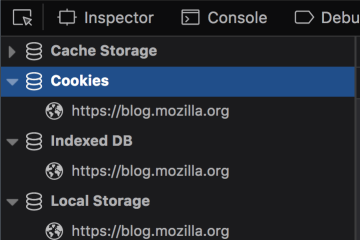

In cases where the top level parent of a tree is a fixed or specified title (like "Cache Storage" and "Cookies" in the Storage panel) the parent node's font weight is increased to `700`. 

#### DOM Panel Tree

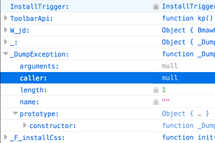

  <input type="radio" name="domtree-style-color" id="domtree-lightmode" checked="checked">
  <label for="domtree-lightmode">Light</label>
  

Arrow: Grey 40 `#b1b1b3`

Background Hover: `#F0F9FE` *Photon color needed*

Bottom Border: `#EFEFEF` *Photon color needed*

#### Selected node
Background: Blue 55 `#0074e8`

Arrow: white semi-opaque image, *Photon color needed*

Text: white `#ffffff`

  

  <input type="radio" name="domtree-style-color" id="domtree-darkmode">
  <label for="domtree-darkmode">Dark</label>
  

Arrow: Grey 50 `#737373`

Background Hover: `#F0F9FE` *Photon color needed*

Bottom Border: `none`

#### Selected node
Background: Blue 70 `#003eaa`

Arrow: white semi-opaque image, *Photon color needed*

Text: white `#ffffff`

  

### Sizes

#### Code Tree

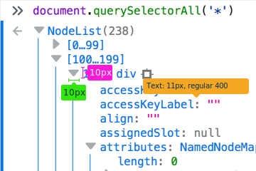

Arrow width: `10px`

Arrow height: `10px`

Text: `11px`, regular `400`

line-height: `16px`

Indent: width(`12px`) + margin(`5px`) = `17px` 

#### Panel Tree

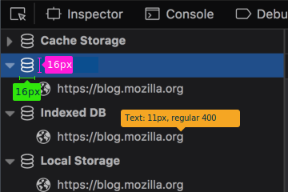

Arrow width: `10px`

Arrow height: `10px`

Icon width: `16px` 

Icon height: `16px`

Text: `11px`, regular `400`

Vertical Padding: `4px` 

Indent: width(`12px`) + margin(`5px`) = `17px`

#### DOM Panel Tree

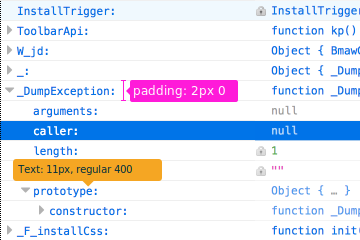

Arrow width: `10px`

Arrow height: `10px`

Text: `11px`, regular `400`

Vertical Padding: `2px` 

Line height: `13.5px`

Indent: `14px`

## Behaviours

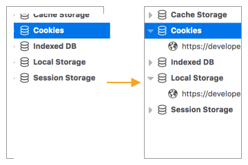

Clicking the arrow icon on a tree node will toggle between the collapsed and expanded states. Expanding the node will reveal the children of that node if any exist. When expanding a node the arrow icon will rotate 90 degrees clockwise from right to downward pointing, the reverse will occur when the node is collapsed.

### Keyboard traversal 

When a collapsed node is selected, hitting the right arrow key on the keyboard will expand the node. When an expanded node is selected hitting the left arrow key will collapse the node.

A hierarchy of nodes within a code tree can be traversed from parent to child by repeatedly hitting the right arrow key, focus will jump to the child nodes which are collapsed allowing them to be expanded without the need to move down the node list manually.

### Drop and drag

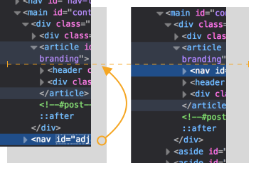

The code tree featured in the DOM Inspector supports drop and drag functionality. Nodes can be selected and with the left mouse button held down, dragged and repositioned into different areas of the DOM.

## Future Improvements

Remove controls.png usage from the Inspector and align with console SVG implementation.

### Imporvements and homogenization of arrow SVG

[Improve the “expand arrow” icon](https://github.com/devtools-html/ux/issues/31)

### Consistency across all panels

[Vertical and horizontal rhythm](https://github.com/devtools-html/ux/issues/3) 

