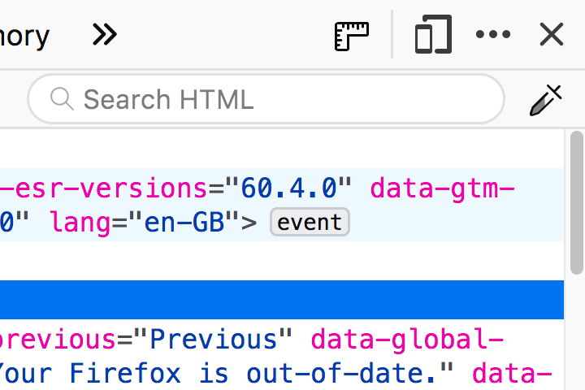

DevTools search and filter input fields provide panel or pane specific search and filtering capabilities.

## Usage

Provide a search or filter input field for users when a panel or pane specific action is capable of producing a large quantity of data of varying types or categories. Typically, the data would be formatted as a list of entries similar to logs in the Console or requests in the Network Monitor.

## Styles

### DevTools search and filter bars

Search and filter bars in DevTools appear within panel toolbars and are often signified by a magnifying glass or filter funnel icon within the field.

Padding inline start: `22px`

Padding inline end: `23px`

Background size: `11px 11px` (icon)

Font size: `11px`

Font weight `400`

#### Icons

[Magnifying glass](https://design.firefox.com/icons/viewer/#search)

[Filter funnel](https://design.firefox.com/icons/viewer/#filter)

#### Color

  <input type="radio" name="tstyle" id="light-mode" checked="checked">
  <label for="light-mode">Light Mode</label>
  

Border: Grey 25 `#e0e0e2`

Background: White `#ffffff`

Placeholder Text: Grey 90 `#0c0c0d` with opacity: `0.54`

Input text: Grey 90 `#0c0c0d`  

  

  <input type="radio" name="tstyle" id="dark-mode">
  <label for="dark-mode">Dark Mode</label>
  

Border: `#3c3c3d` *Photon color needed*

Background: `#141416` *Photon color needed*

Placeholder Text: Grey 20 `#ededf0` with opacity: `0.54`

Input text: Grey 20 `#ededf0`

  

#### Focus

Border color: `#0675d3` *Photon color needed*

Shadow color: `rgba(97,181,255,.75)` *Photon color needed*

#### Mac variation

On macOS the search bars are given rounded edges.

Border radius: `20px`

### Console filter 

The console toolbar provides users with a “Toggle filter bar” button which toggles the visibility of a secondary toolbar containing category filter buttons. 

The “Toggle filter bar” button is illustrated with the filter funnel icon, as such this icon is not repeated within the filter input field.

### Network Monitor filter

Upon hover, The filter input bar within the Network Monitor reveals a “Learn more about filtering” button (illustrated with the [help](https://design.firefox.com/icons/viewer/#help)/question mark icon), clicking this button directs users to an MDN article which examines Network Monitor filtering and other Network Monitor exclusive topics.

## Behaviour
 
### Filter feedback

{:.animated}

The filter input bar provides visual feedback to the user depending on whether a text match is found.

In addition to the color changes below, the clear search icon within the input field also changes to a red variant in the event that no match is discovered.

#### Color

  <input type="radio" name="tbehaviour" id="filter-light-mode" checked="checked">
  <label for="filter-light-mode">Light Mode</label>
  

#### Match found

Background: `#FFF89E` *photon color needed*

Border: `#ffbf00` *photon color needed*

#### No match found

Background: `#ffe5e5` *photon color needed*

Border: `#e52e2e` *photon color needed*

  

  <input type="radio" name="tbehaviour" id="filter-dark-mode">
  <label for="filter-dark-mode">Dark Mode</label>
  

#### Match found

Background: `#4d4222` *photon color needed*

Border: `#d99f2b` *photon color needed*

#### No match found

Background: `#402325` *photon color needed*

Border: `#cc3d3d` *photon color needed*

  

### Clear field "X" button

When text is entered into either a search or filter input bar, a “search clear” button should appear within the input area illustrated by a cross enclosed in a circle.

Clicking the button should immediately clear any entered contents of the input field, revealing the initial placeholder text.

### Autocomplete box

{:.animated}

Search input bars can provide the user with an optional autocomplete popup when text entered matches one or more existing patterns. 

In the Inspector, the search autocomplete box presents matches for tag and class names.

## Future Improvements

### Standardising and combining

The console requires a search interface to be exposed, this project which is currently in discussion on [Github](https://github.com/devtools-html/ux/issues/38) raises questions regarding the future of the filter interface.

Suggestions include a custom filter doorhanger menu, a combination search/filter interface and  button to reveal an additional filter input below the search bar. 

Work carried out in the console should also be considered for application to the Network Monitor in an effort to further standardise the toolbar behaviour across panels.

