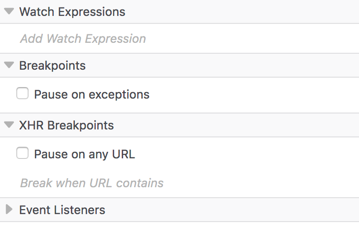
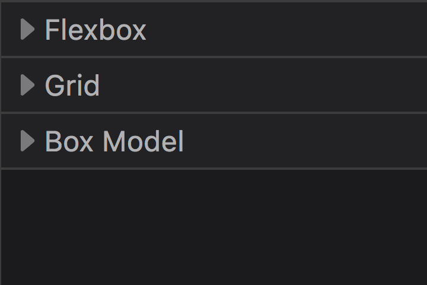
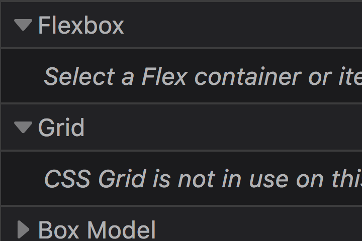
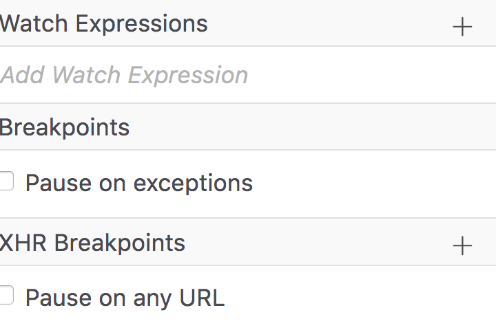
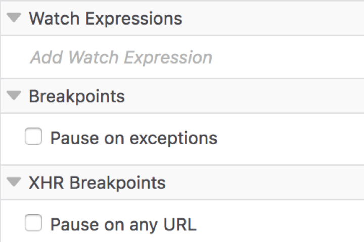
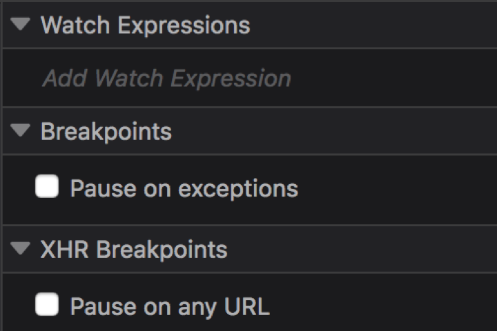
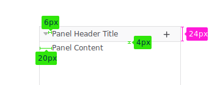
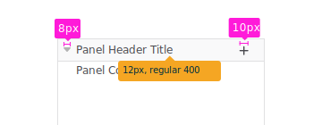
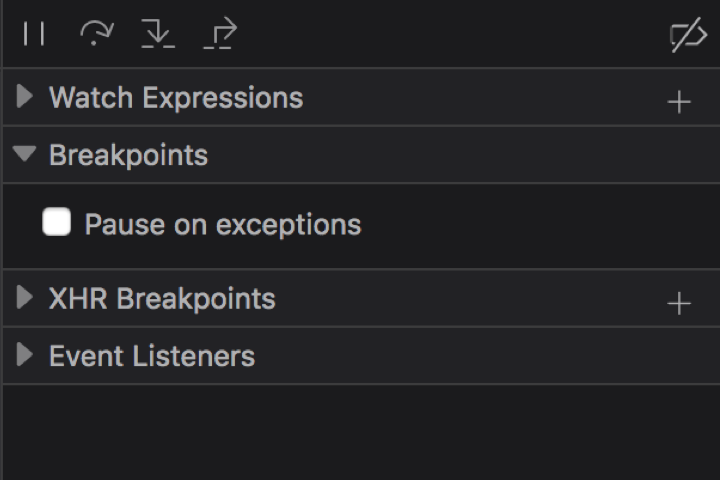

Panes are the visual containers which separate and group tools by areas of functionality. An example would be the Breakpoints pane in the Debugger, which groups all controls which govern the creation, deletion and management of breakpoints.

Panes are themselves often grouped together to form a panel. The Layout panel for example, contains the Flex Container, Grid and Box Model panes.

## Usage

A pane should be used when a series of controls which relate to the same task or piece of functionality need to be visually grouped under a single umbrella term.

## Structure

Striped of their unique content, a pane is simply a container for other elements and controls. A pane has a header, a bar which runs the width of the pane and is positioned at the very top of the pane. The header must contain the following item:

### Pane Title

The pane title appears to the right of the arrow icon (or simply left aligned in the event that the panel does not expand or collapse) and provides a fitting label to the grouped content within the pane.

In addition to the required element above, a header can also contain: 

### Arrow (expand/collapse)

The arrow icon indicates that a particular pane can be expanded and collapsed and what the current expanded state is (a downward pointing arrow indicates that the pane is expanded). When present, The arrow appears as the leftmost element in the pane header.

### Button(s)

Primary functions belonging to a pane may be exposed within the pane header to increase visibility and to reduce the need for an additional toolbar. 

The Watch Expressions pane in the Debugger is a good example, the pane header offers an “Add Watch Expression” button (represented by a plus symbol) allowing users to quickly add new expressions.
Functional buttons must appear right aligned within the pane header.

## Style

  <input type="radio" name="tstyle" id="style-generic" checked="checked">
  <label for="style-generic">Light</label>
  

### Color

#### Pane

Background: white `#ffffff`

Border/Splitter: Grey 25 `#e0e0e2`

#### Header

Background: Grey 10 `#f9f9fa`

Text: Grey 90 `#0c0c0d`

Arrow: `rgba(0, 0, 0, 0.3)`

Icon: Grey 60 `#4a4a4f`

#### Header Hover

Background: Grey 20 `#ededf0`

Cursor: `default`

  

  <input type="radio" name="tstyle" id="style-success">
  <label for="style-success">Dark</label>
  

  
### Color

#### Pane

Background: Grey 85 `#1b1b1d`

Border/Splitter: `#3c3c3d` *Photon color needed*

#### Header

Background: `#222225` *Photon color needed*

Text: Grey 40 `#b1b1b3`

Arrow: `rgba(255, 255, 255, 0.4)`

Icon: Grey 40 `#b1b1b3`

#### Header Hover

Background: Grey 80 `#2a2a2e`

Cursor: `default`

  

### Sizes

#### Pane

Padding `4px 20px`

#### Header

Height: `24px`

Text: `12px, regular 400`

Padding: `4px 20px`

**Note:** The 20px left padding is the sum of 6px padding either side of the 8px arrow icon.

#### Arrow

Width: `8px`

Height: `8px`

Containing an `8px` x `5px` SVG

#### Icons

width: `10px`

height: `10px`

## Behaviours

### Expand and collapse

Panes which include an arrow icon within the header indicate that their content can be expanded or collapsed. 

The expanded state is toggled by single clicking the header and any element within it excluding buttons.

When a pane is collapsed only the pane header is visible.

