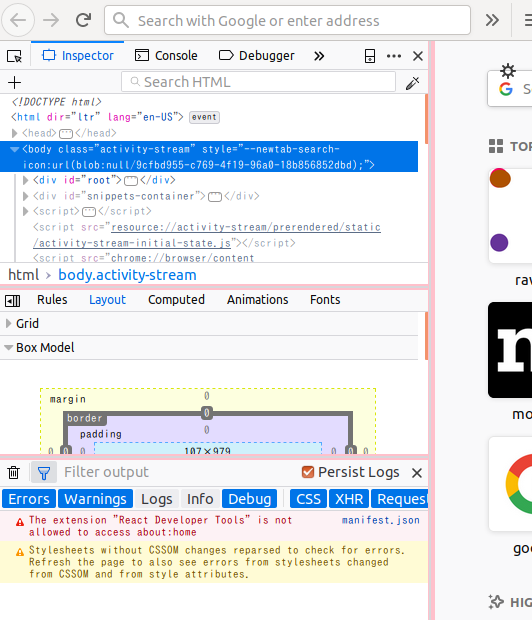

Splitters are used to separate the contents of developer tools into several resizable panes.

## Usage

Some split panes in developer tools can be activated using the sidebar toggle button or by turning on the split Console.

## Future Work

In vertical mode, horizontal splitters will be 2px wide and have a hover effect to differentiate them from other horizontal lines. This is currently available in Nightly ([bug](https://bugzilla.mozilla.org/show_bug.cgi?id=1465644)).
