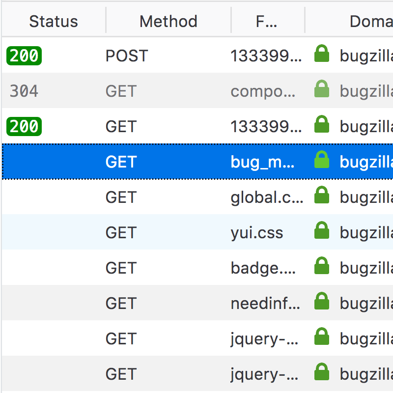
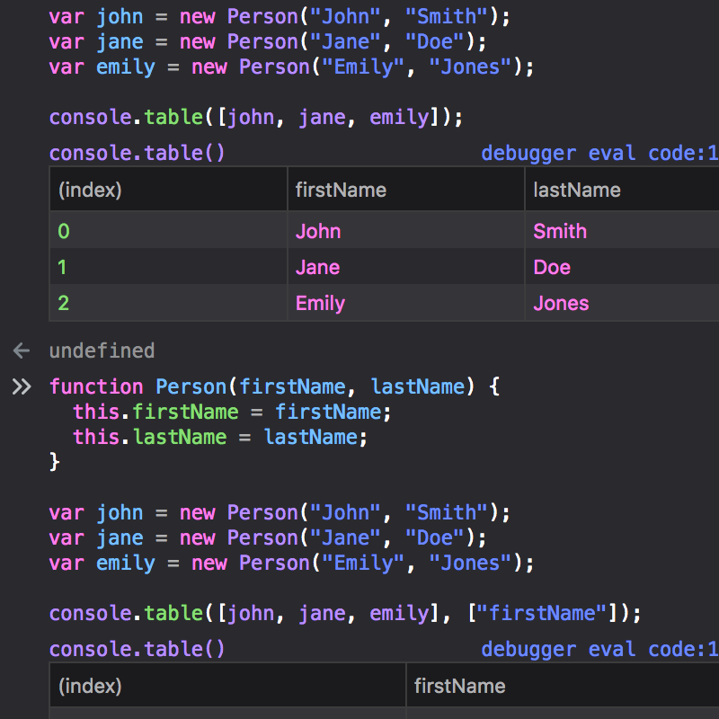
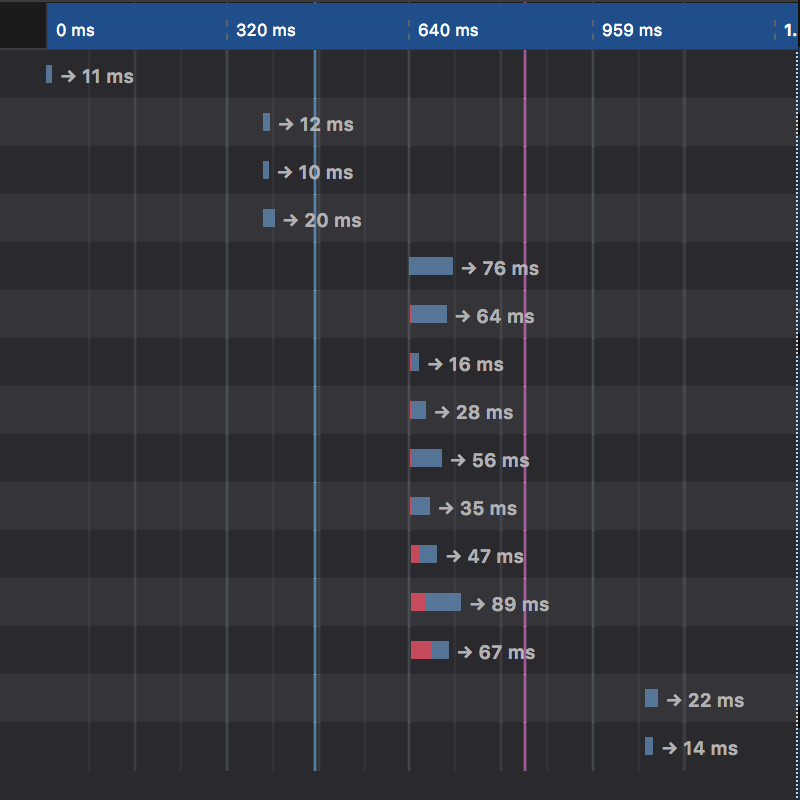
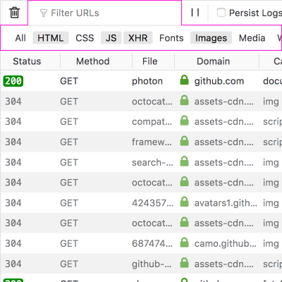
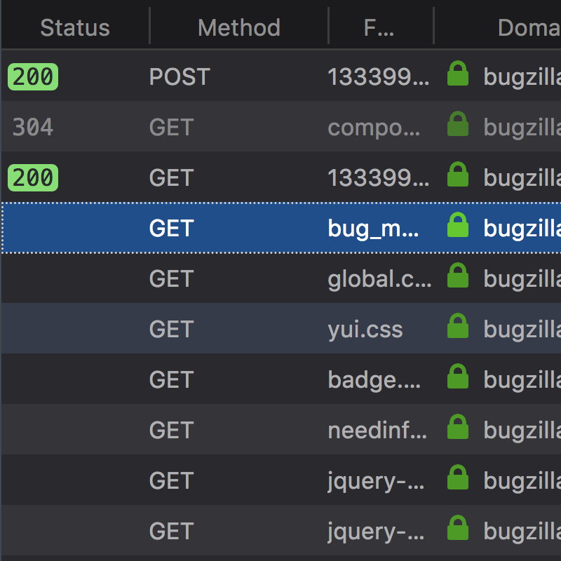
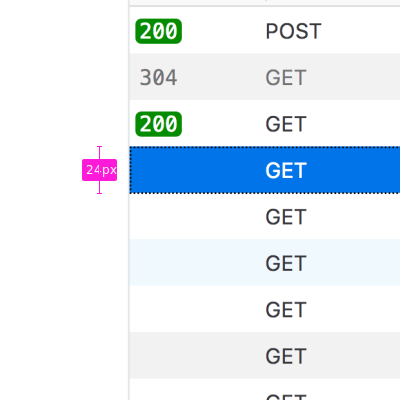
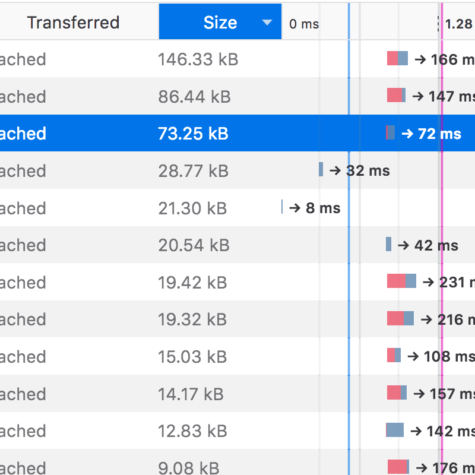
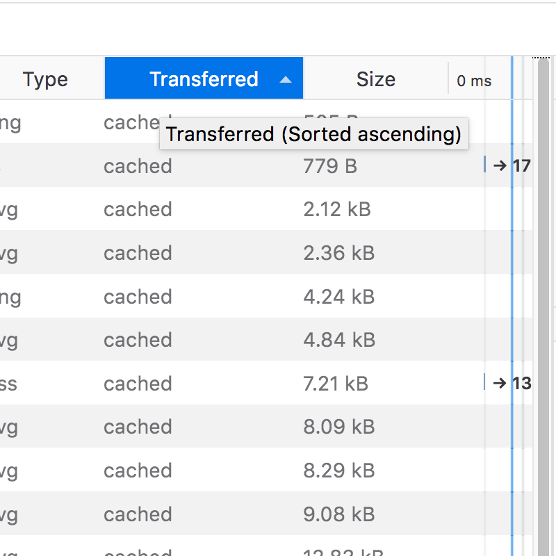
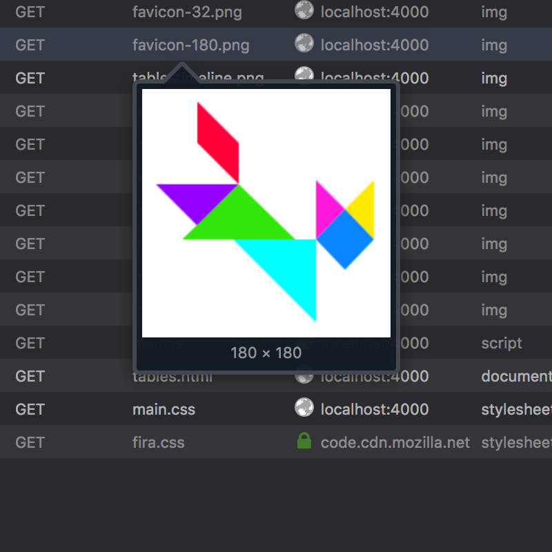

Tabular data appears in a variety of places, the Network panel is the most obvious example. The console is also able to output a visual table using `console.table()` e.g. `console.table(["apples", "oranges", "bananas"]);`.

## Usage

Tables are used when data needs to be presented in a series of rows which may also possess any amount of columns. For large quantities of data it is recommended to include an interactive column header allowing users to sort the data by that specific column, as seen in the Network panel.

## Types

### Console tables

The console can display a tablular representation of an Array or Object. e.g. `console.table(["apples", "oranges", "bananas"]);`

Console table columns are not sortable or resizable.

### Network and Application panel
    

The Network panel table features column sorting and row highlighting on hover. The table can contain a rich variety of data including text, badges, images ([icons](../visuals/iconography): `16px` x `16px`) and timeline interface elements like graphs and vertical rules (pictured).

Filter controls are provided in the form of buttons for specific resource types and a filter input field for filtering URLs.

## Styles

Table rows alternate their background color, the subtle "zebra" effect assists in legibility:

### Dark mode

Odd Row Background Color: Grey 80 `#2a2a2e`

Even Row Background Color: `rgba(255,255,255,0.05)` (RGBA overlays the default Grey 80 `#2a2a2e`)

Column Header Background Color: Grey 85 `#1b1b1d`

Border/splitter Color: Grey 70 `#38383d`

Text Color: Grey 40 `#b1b1b3`

#### Selected row:

Background Color: Blue 70 `#003eaa`

Text Color: white `#ffffff`

### Light mode

Odd Rows Background Color white `#ffffff`

Even Rows Background Color: `rgba(0,0,0,0.05)` (RGBA overlays the default white `#ffffff`)

Column Header Background Color: Grey 10 `#f9f9fa`

Border/splitter Color: Grey 25 `#e0e0e2`

Text Color: Grey 70 `#38383d`

#### Selected row:

Background Color: Blue 55 `#0074e8`

Text Color: white `#ffffff`

Font size: `11px`

Row height: `24px`

Line height: `24px`

## Behaviours

### Sorting

Tables should possess sortable column headers, clicking these buttons will toggle the sorting of the column they relate to. 

In the image, clicking the interactive "Size" header toggles the Size column from largest to smallest and from smallest to largest.

#### Selected Column Header (Light mode):

Background Color: Blue 55 `#0074e8`

#### Selected Column Header (Dark mode):

Background Color: Blue 70 `#003eaa`

If the table header is a clickable button to provide sorting controls, the tooltip should illustrate what the current sorting pattern is e.g. Sorted ascending, Sorted descending. 

### Rich tooltips and previews

Table cell tooltips have the opportunity to provide extra information/context to the data being hovered over. For example, a domain name when hovered can additionally provide the IP address of the domain.

When an image name is hovered over a [doorhanger](./doorhangers) should present a preview of the image with a caption containing the real pixel dimensions.

## Future Improvements

### Column resizing and sorting

All tables should provide column resizing and sorting functionality. Currently, not all tables provide these features.

The Network table requires individual column resizing capabilities so that lengthy strings like filenames and domains can be read easily without the need to alter the devtools or browser window width. 

Tables output to the console appear static, column headers provide no sorting behaviours. 

### Revision to zebra stripe and hover color scheme

The current table zebra effect is quite intense and should be revised for a subtler appearance that is easier on the eyes. Additionally, the row highlight color should perhaps be a modification of the underlying row color as opposed to being a solid hover color for both odd and even rows, this will retain the zebra effect while moving the cursor down the table. 

See: [Improve zebra table colors (Network, Storage)](https://github.com/devtools-html/ux/issues/10) 