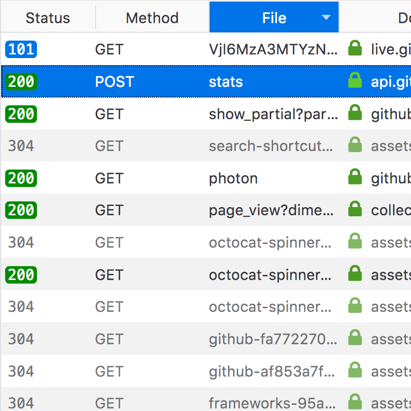

Tabular data appears in a variety of places, the Network panel is the most obvious example. The console is also able to output a visual table using `console.table()` e.g. `console.table(["apples", "oranges", "bananas"]);`

## Usage

Tables are used when data needs to be presented in a series of rows which may also posses any amount of columns. For large quantities of data it is recommended to include a button column header allowing users to sort the data by that specific column, as seen in the Network panel

## Types

### Console tables

The console can display a tablular representation of an Array or Object. e.g. `console.table(["apples", "oranges", "bananas"]);`

Console table columns are not sortable or resizable.

### Network and Application panel
    

The Network panel table features column sorting and row highlighting on hover. the table can contain a rich variety of data including text, images (icons: `16px` x `16px`) and timeline interface elements like graphs and vertical rules (pictured).

Filter controls are provided in the form of buttons for specific resource types and a filter input field for filtering URLs.

## Styles

Table rows alternate their background color, the subtle "zebra" effect assists in legibility:

### Dark mode

Odd rows: Grey 80 `#2a2a2e`

Even rows: `rgba(255,255,255,0.05)`

Column header: Grey 85 `#1b1b1d`

Borders/splitters: `#3c3c3d`

Text: Grey 40 `#b1b1b3`

Selected row: `#204E8A`

### Light mode

Odd rows: white `#ffffff`

Even rows: `rgba(0,0,0,0.05)`

Column header: Grey 10 `#f9f9fa`

Borders/splitters: Grey 25 `#e0e0e2`

Text: Grey 70 `#38383d`

Selected row: Blue 55 `#0074e8`

Font size: `11px`

Row height: `24px`

Line height: `24px`

## Behaviours

### Sorting

Tables can posses sortable column headers, clicking these buttons will toggle the sorting of the column they relate to. In the image, clicking the "Size" button header toggles the Size column from largest to smallest and from smallest to largest.

Selected column header (Light mode): Blue 55 `#0074e8`

Selected column header (Dark mode): `#204E8A`

If the table header is a clickable button to provide sorting controls, the tooltip should illustrate what the current sorting pattern is e.g. Sorted ascending, Sorted descending. 

### Rich tooltips and previews

Table cells tooltips have the opportunity to provide extra information/context to the data being hovered over. For example, a domain name when hovered can additionally provide the IP address of the domain.

When an image name is hovered over a [doorhanger](./doorhangers) should present a preview of the image with a caption containing the real pixel dimensions.

## Future Improvements

### Column resizing
The Network table in particular requires individual column resizing capabilities so that lengthy strings like filenames and domains can be read easily without the need to alter the devtools or browser window width. 
Perhaps not a requirement for console tables.

###Sortable console table columns
Tables output to the console appear static, column headers provide no sorting behaviours. 