Toolbars group buttons and controls together in a horizontal line spanning the width of a panel they have control over. Toolbars are typically located at the top of a panel, the controls they house change the state or perform actions on the content of their panel parent.

## Usage

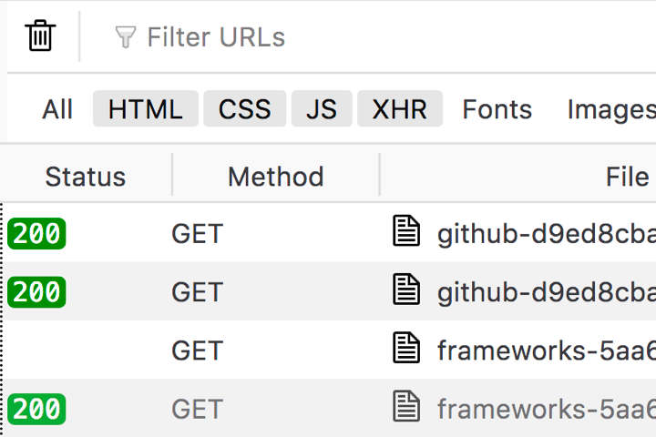

A toolbar should be utilised when a series of grouped buttons or controls specific to a panel should appear high in the content hierarchy. A good example would be to house a series of filter controls which changes the global state or content of a panel, as seen in the Network Panel sub-toolbar.

## Types

### Main toolbar

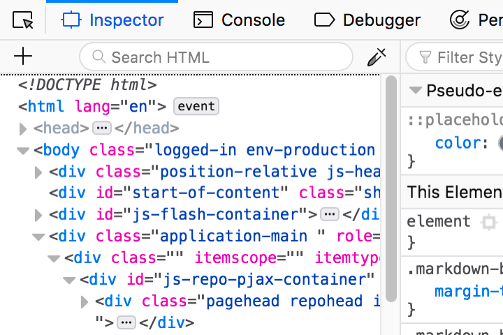

The main “toolbox” toolbar which spans the width of Developer Tools Window.

### Sub-toolbar

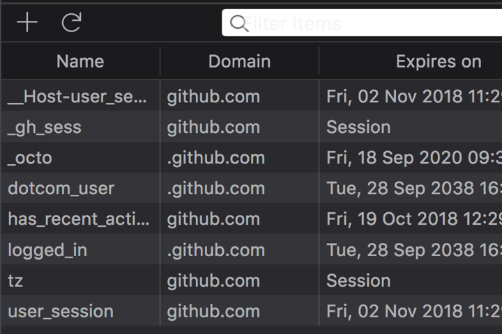

Subheader toolbars are specific to individual panels, a good example is the Network Panel toolbar which houses filter tools and viewing options, tools specific to the Network Panel.

## Structure

Toolbars are used as containers for other elements, as such their structure can vary greatly. There are however some common patterns which should be acknowledged for improved consistency among existing implementations.

### Control grouping

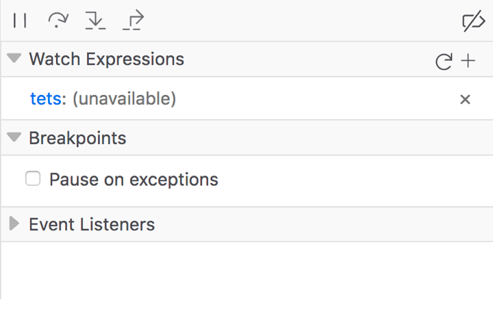

Buttons or controls which provide primary functions should be grouped and left aligned within the toolbar. 
Controls which provide secondary or ancillary functionality should be grouped and right aligned within the toolbar.

This pattern is observed in the Main toolbar, the Console and the Debugger Breakpoint toolbar.

### Search and filter input

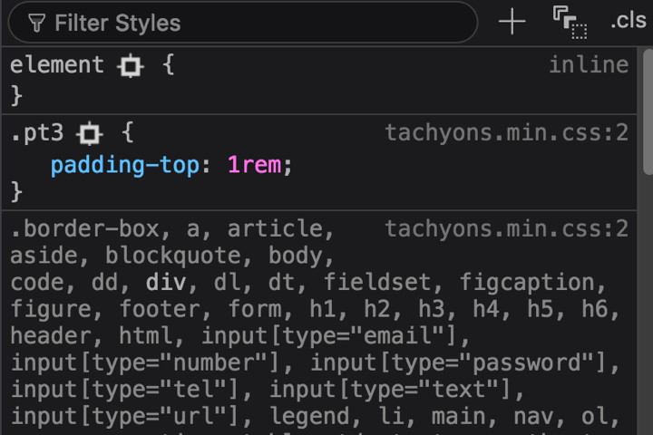

The placement of a search or filter input can vary within a toolbar depending on its perceived priority. As a rule of thumb, the more objective critical an input field is to a panel, the more it should appear toward the left of the toolbar. 

Input fields which provide more ancillary functionality should appear right aligned.

### Close button.

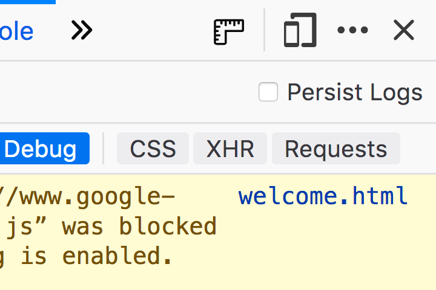

Remaining consistent with well established patterns, the button used to close a panel should be represented by a cross “X” [icon](https://design.firefox.com/icons/viewer/) and appear as the rightmost button in the toolbar.

### Clear and delete functions

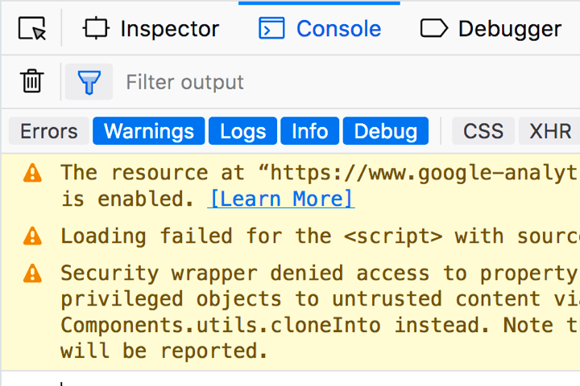

If the toolbar is to contain a control which clears the content of a panel (typically a list of entries), the control should be a button represented by the “classic steel bin” [icon](https://design.firefox.com/icons/viewer/) and should appear as the leftmost button in the toolbar.

## Styles

### Toolbar Button Color

<!-- == tabs start == -->

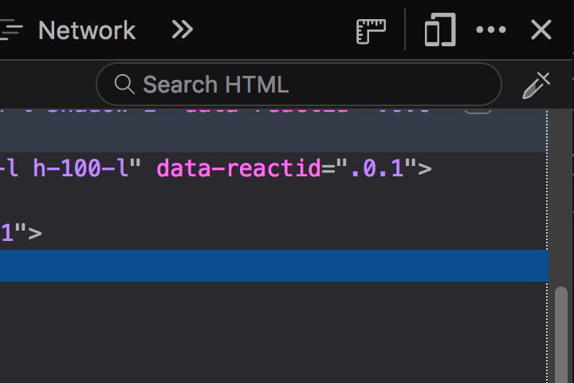

  <input type="radio" name="toolbar-style-color" id="toolbar-lightmode" checked="checked">
  <label for="toolbar-lightmode">Light</label>
  

Background: `transparent`, inherits toolbar background (Grey 10 `#f9f9fa`)

Icon: Grey 90 `#0c0c0d`

#### Hover

Background: Grey 20 `#ededf0`

Icon: Grey 90 `#0c0c0d`

#### Selected

Background: Grey 20 `#ededf0`

Icon: Blue 60 `#0060df`
  

  <input type="radio" name="toolbar-style-color" id="toolbar-darkmode">
  <label for="toolbar-darkmode">Dark</label>
  

Background: `transparent`, inherits toolbar background (Grey 90 `#0c0c0d`)

Icon: Grey 40 `#b1b1b3`

#### Hover

Background: `#252526` *Photon color needed*

Icon: Grey 40 `#b1b1b3`

#### Selected

Background: `#252526` *Photon color needed*

Icon: `#75BFFF` *Photon color needed*
  

<!-- == tabs end == -->

### Toolbar Tab Color

<!-- == tabs start == -->

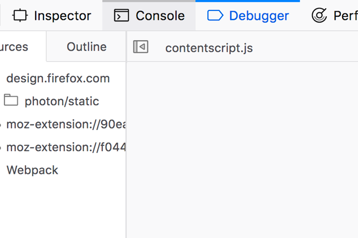

  <input type="radio" name="toolbar-tab-style-color" id="toolbar-tab-lightmode" checked="checked">
  <label for="toolbar-tab-lightmode">Light</label>
  

Background: `transparent`, inherits toolbar background (Grey 10 `#f9f9fa`)

Text: Grey 90 `#0c0c0d`

Icon: Grey 90 `#0c0c0d`

#### Hover

Background: Grey 20 `#ededf0`

Text: Grey 90 `#0c0c0d`

Icon: Grey 90 `#0c0c0d`

Tab top border (main toolbar only): `rgba(0,0,0,0.2)` *Photon color needed*

#### Selected

Background: `transparent`, inherits toolbar background (Grey 90 `#0c0c0d`)

Text: Blue 60 `#0060df`

Icon: Blue 50 `#0a84ff`

Tab top border (main toolbar only): Blue 50 `#0a84ff`

  

  <input type="radio" name="toolbar-tab-style-color" id="toolbar-tab-darkmode">
  <label for="toolbar-tab-darkmode">Dark</label>
  

Background: `transparent`, inherits toolbar background (Grey 90 `#0c0c0d`)

Text: Grey 40 `#b1b1b3`

Icon: Grey 40 `#b1b1b3`

#### Hover

Background: `#252526` *Photon color needed*

Text: Grey 40 `#b1b1b3`

Icon: Grey 40 `#b1b1b3`

Tab top border (main toolbar only): `rgba(255,255,255,0.2)` *Photon color needed*

#### Selected

Background: `transparent`, inherits toolbar background (Grey 90 `#0c0c0d`)

Text: white `#ffffff`

Icon: white `#ffffff`

Tab top border (main toolbar only): Blue 50 `#0a84ff`

  

<!-- == tabs end == -->

### Sizes

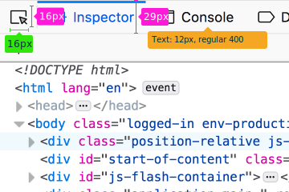

#### Main toolbar

Height: `29px`

Text: `12px`, regular `400`

**Icons**

Width: `16px`

Height: `16px`

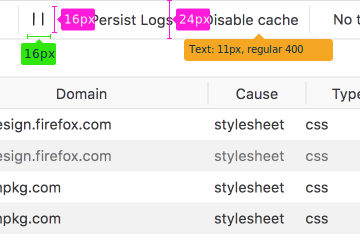

#### Sub-toolbar

Height: `24px`

Text: `11px`, regular `400`

**Icons**

Width: `16px`

Height: `16px`

## Behaviours

Toolbars can contain a variety of different elements, these include but are not limited to:

* **Buttons** Often acting as tabs to alter the view of the window.
* **Separators** Typically a simple line which provides a method of separating groups of controls.
* **Icons** SVGs which typically appear within a button element to illustrate the button action.
* **Form controls** Checkboxes and input fields for filtering and customising the current view.

### Resizing 

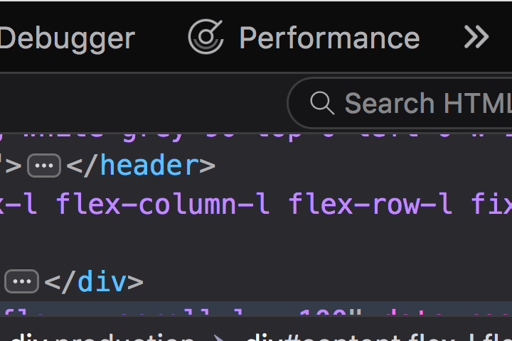

When the parent panel of a toolbar is resized to a width that is smaller than the natural width of the toolbar’s combined child elements, an overflow button appears which provides menu ([doorhanger](doorhangers)) access to the elements which are no longer visible.

The double-chevron button is removed if the width of the parent panel is increased to allow for all of the toolbar menu items to appear in a  single row.

