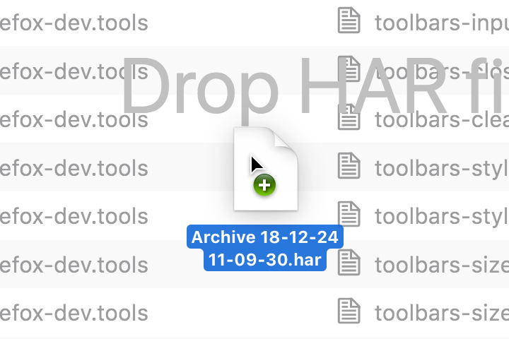
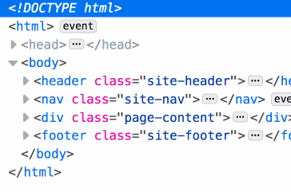
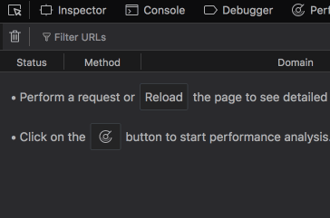

Drag and drop is a common gesture seen in many different forms of software.

It can be used to surface additional information such as relationships between two interactive objects and revealing whether certain interactions are possible or nonexistent.

## Usage

Drag and drop can be used to supplement an existing action, adding an additional layer of UX enhancement to an otherwise intricate task.

Drag and drop can be encouraged as the primary method to achieve an objective if alternative methods would be a more convoluted or particularly complex task to undertake.

## Primary pattern

Sometimes the obvious mechanism to carry out a task efficiently is drag and drop. Actions which require the rearranging, reordering and moving of on screen elements are frequently seen to employ a drag and drop ability as their primary mechanism.

{:.animated}

The Inspector allows users to drag and drop elements to restructure the DOM tree.

Alternative means to fulfil critical actions are required to prevent the exclusion of keyboard only users, see [Accessibility](#accessibility).

## Supplementary pattern

Drag and drop can be used to enhance the user experience of an existing action. A common scenario is allowing users to drop files from their computer into the browser window to upload or process a file. 

{:.animated}

Dropping HAR files into the Network panel window is an example of this supplementary behavior.

Typically an “import” or “select file” action would already be present in the UI to achieve the task, however allowing users to simply drag a file into the browser window eliminates the need for the user to battle additional dialogs and file system traversal.

## Accessibility

Not all users have the ability to use a pointing device, as such if drag and drop is endorsed as the primary means to achieve an objective, that same objective must be achievable through alternative means.
The WCAG 2.0 specification states that:

> *“An application that uses drag and drop also supports "cut" and "paste" or form controls to move objects.”*
>
> [WCAG 2.0](https://www.w3.org/TR/UNDERSTANDING-WCAG20/keyboard-operation-keyboard-operable.html) Understanding WCAG 2.0,  Keyboard Operation

Where possible, utilise familiar keyboard shortcuts or UI buttons to provide users the ability to move and rearrange items in a cut/paste fashion.

## Future Work

**It is our ambition to provide keyboard access to all drag and drop centric actions.** This includes keyboard traversal, cut and paste actions.

### Inspector Improvements

The Inspector’s context menu provides the ability to copy and paste elements in the DOM tree. Even with OS level accessibility enhancements enabled (Mouse Keys for example) there are still shortcomings which increase the complexity of keyboard only usage, a simpler cut and paste method may help alleviate the intricacy of this task.

### Tab Reordering

Rearranging the DevTools toolbar may not be an objective critical feature but providing a keyboard only method to achieve this would be appreciated by our users.

