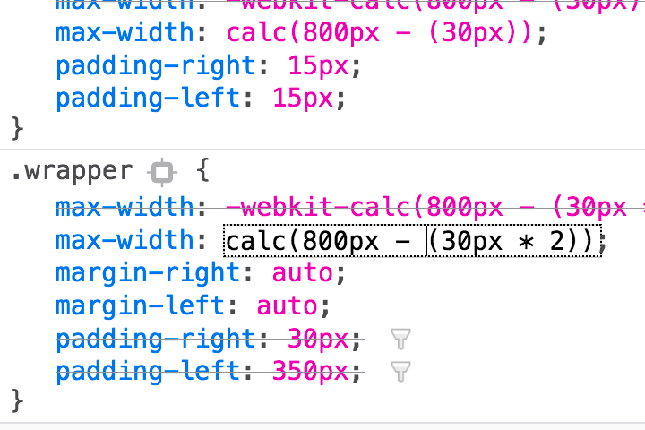
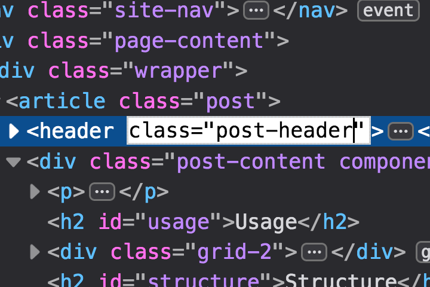
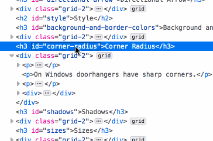

Inline editors provide in-context text editing capabilities without directing users to a new interface or modal dialog.
Inline editors are largely used in code output where maintaining syntax structure is important.

## Usage

Inline editors should be provided to users where it is desirable to edit segments of text (typically code) without disrupting the larger document. 

## Style

The inline editor is largely without prescribed style and adopts various properties for text size and height from its parent element. 
When focused it is highlighted by a dotted outline. 

When editing, the text color becomes black and the textarea background becomes white regardless of the syntax highlighting or whether the user is using light or dark mode.

## Behavior

For isolated segments of code or text, where an individual property or value is present (the Rule View pane), the inline editor should be invoked upon a single click on the qualifying text or code.

In areas where a large body of code is present (the Inspector), the inline editor should be invoked by double clicking a qualifying segment of text.  Additionally, the inline editor should be invoked when the user hits enter and a selected segment of editable text has focus.

