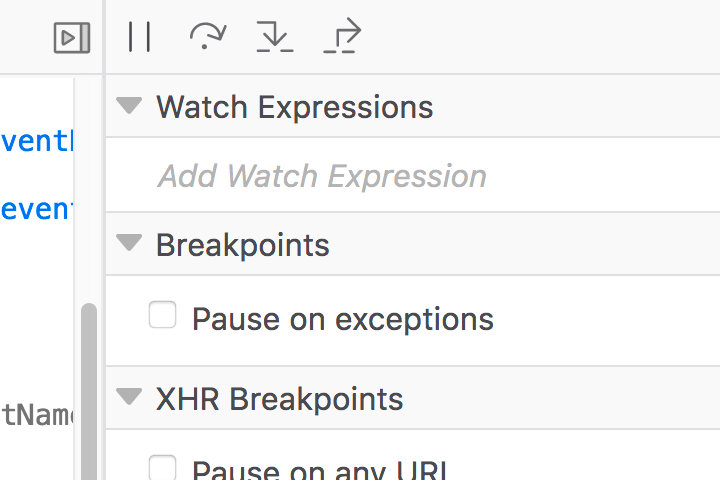
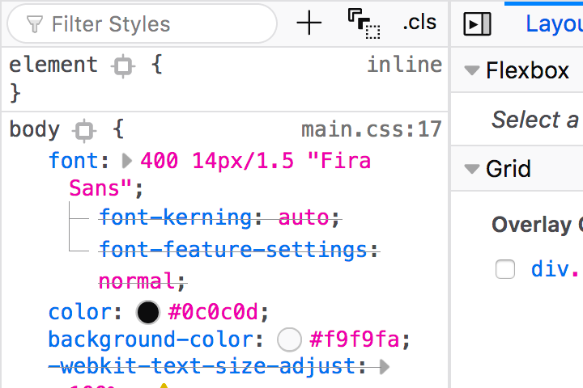
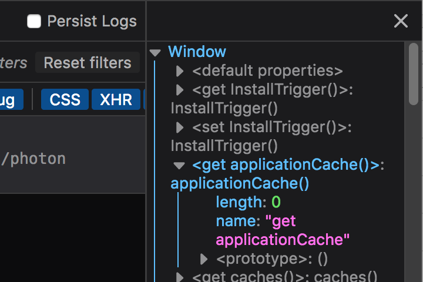
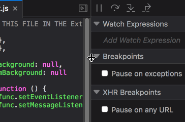
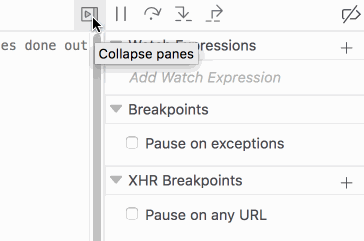
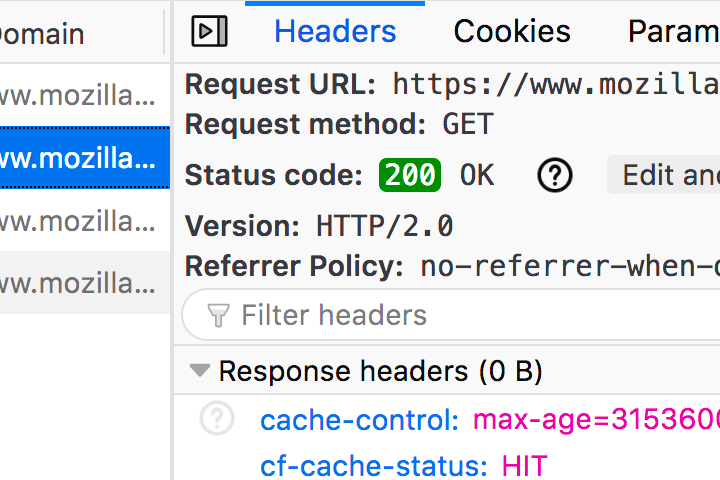

## Usage

Sidebars are a flexible mechanism which can be used to both group and control the visibility of panes. Sidebars can be utilised to subdivide an interface and provide an enhanced responsive experience for large displays.

## Types

### Enclosing sidebars

Enclosing sidebars are key layout influencers which can contain groups of individual panes.
The presence of an enclosing sidebar is often signified by an expand/collapse panes button.

Enclosing sidebars can also separate and subdivide panes into separate panels, a key example of this is the Inspector rules sidebar. Clicking the "Toggle 3-pane" button in the Inspector will toggle the location of the Rule View Panel to and from its own sidebar.

### Ancillary sidebars

Whereas enclosing sidebars would often contain separate panes, Ancillary sidebars are a subset which appear within individual panes.

Ancillary sidebars are used to provide more granular data to a selected items within the main pane. An example of this behaviour is the console sidebar which appears when the user holds command (macOS) or control (Windows)  and clicks an object reference within a console message, the sidebar appears and displays the object’s contents.

As ancillary sidebars provide in context information, a button to toggle the sidebar’s visibility is replaced with a simpler close button to remove the sidebar when it is not required.

## Behaviors

### Resize

{:.animated}

All sidebars should be resizable, allowing the user to customize the layout to adapt to the task at hand. The ability to resize a sidebar should be signified to the user by changing the mouse cursor from a `default` pointer to a `ew-resize` pointer when the cursor enters the draggable edge of the sidebar. 

### Open, close and split states

Clicking a sidebar’s corresponding expand/collapse button should toggle the sidebar's expanded state.
Ancillary sidebars which can appear through any variety of pane specific actions should have a close button to dismiss the sidebar completely.

### Keyboard access

Panel toggle and close buttons must achieve tab focus via the keyboard, when the button is focused pressing enter should invoke the button action.

## Future Improvements

### Animation

{:.animated}

The "Collapse Panes" buttons in the debugger currently sport an onclick animation. When activated, the buttons rotate 180 degrees in 0.25 seconds. The quick animation escapes the user as their focus on the button is lost during the instant relocation of the panel and button. The animation is only witnessed in full if the user focuses on the area of the screen where the buttons will eventually move to (not from).

A better use of animation may be having the panels themselves slide in and out, this might be particularly useful for the "Toggle 3-pane" button in the Inspector, where it is perhaps not immediately obvious what is occuring or where the additional panel has emerged from.

### Network Details panel sidebar classification

In its current form the Network Details panel identifies as an enclosing sidebar, the sidebar contains a variety of individual panes and is closed by clicking the corresponding "Hide request details" button which utilises the same icon as the Debugger's "Collapse panes" button.

However its behaviour is that of an ancillary sidebar, providing rich data specific to the selected item in the Network Monitor and only appearing when an item in its parent container is selected.

Some decisions could be made in an attempt to classify this sidebar. Should the "Hide request details" button act as a toggle and never be entirely dismissed from the UI (like the debugger sidebars). Perhaps the "Hide request details" button should be replaced with a simple close “X” which would align with its current behaviour of removing the sidebar entirely.

